# 租房系统
基于SpringBoot实现的租房系统，包括三种角色：管理员、房东、租客。

详细介绍：[https://liuyanzhao.com/shop/manland.html](https://liuyanzhao.com/shop/manland.html)  
预览地址：[http://manland.liuyanzhao.com](http://manland.liuyanzhao.com)     
开发时间 2020年10月17日，最近更新2021年03月17日  

#### 管理员功能：
- 房屋管理
- 租房类型管理(合租/整租)
- 房屋管理
- 订单管理
- 新闻公告管理
- 收支明细
- 用户管理
- 角色管理、权限管理

#### 房东功能
- 房屋管理
- 订单管理：取消订单、审核退租、查看合同、下载打印合同
- 收支明细
- 个人信息修改、账号密码修改

## 租客功能
订单管理：创建订单、确认合同、支付订单、取消订单、退租、电子合同查看、下载打印合同
收支明细
个人信息修改、账号密码修改

## 技术组成
- SpringBoot
- MyBatis
- Shiro
- Thymeleaf
- Bootstrap + jQuery
- MySQL
- Maven

## 预览

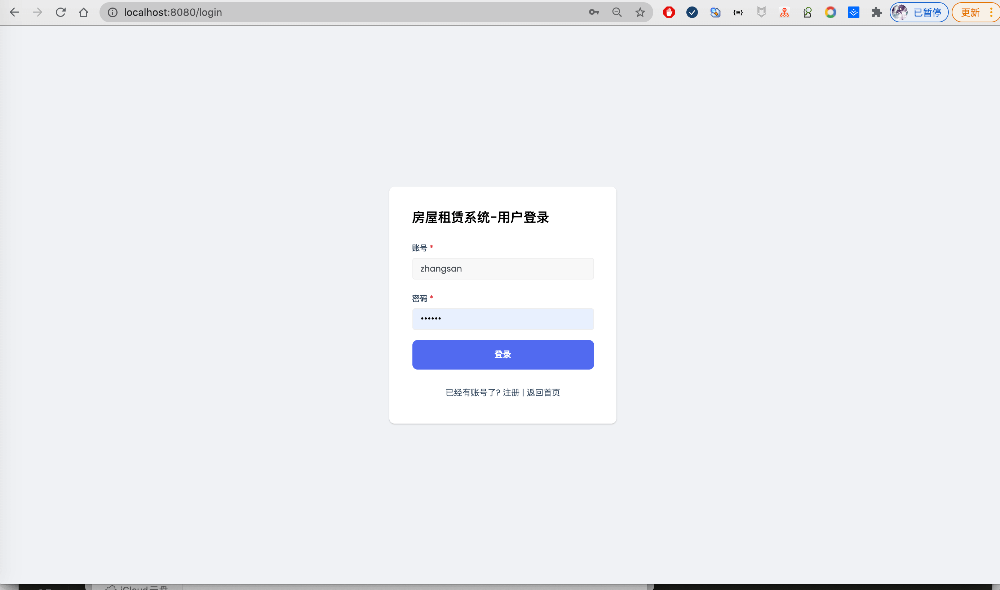
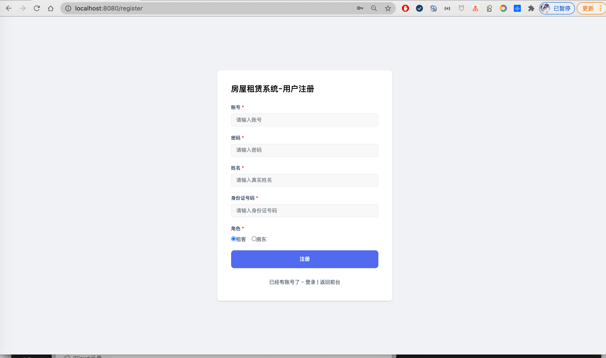
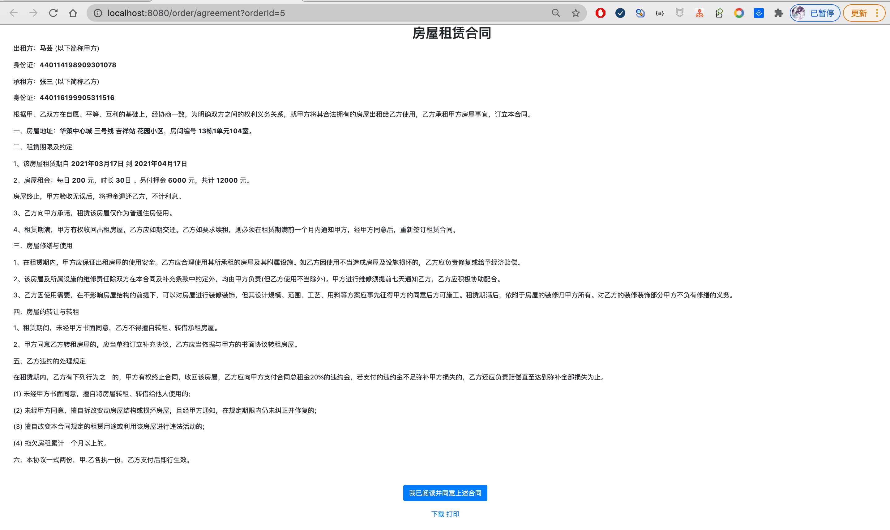

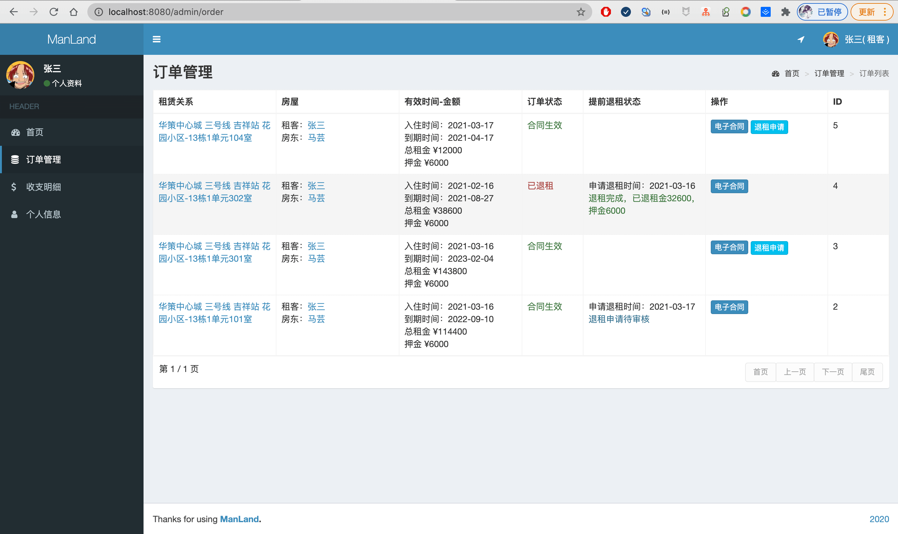
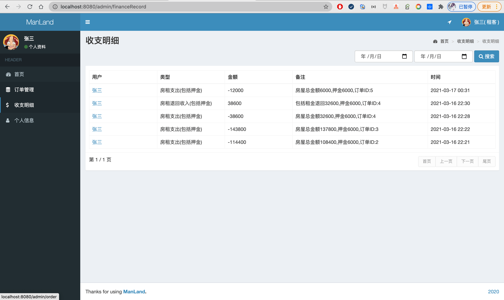
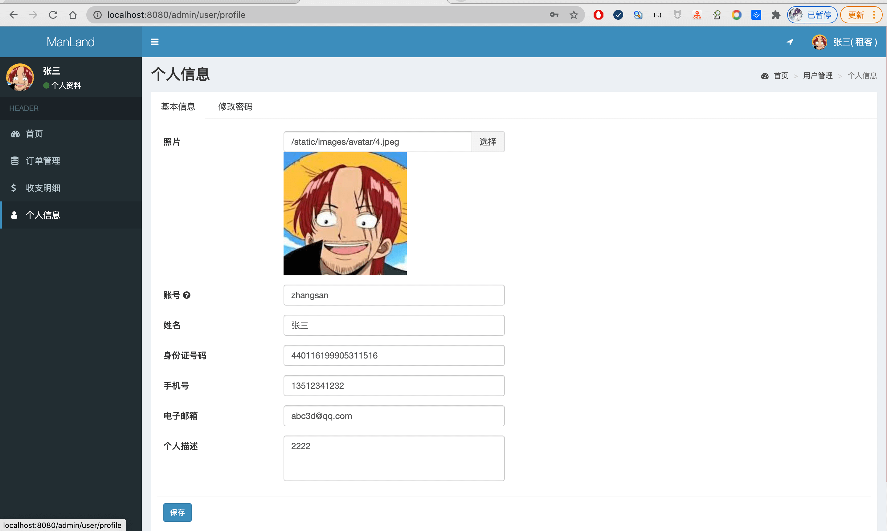
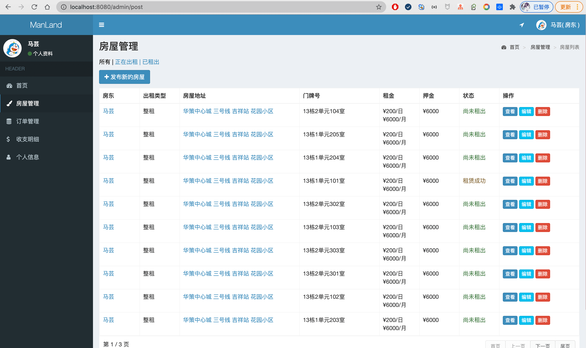
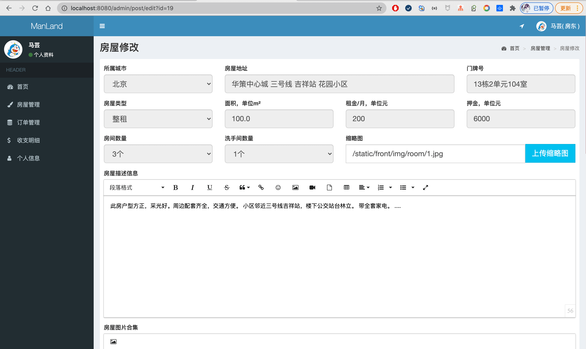
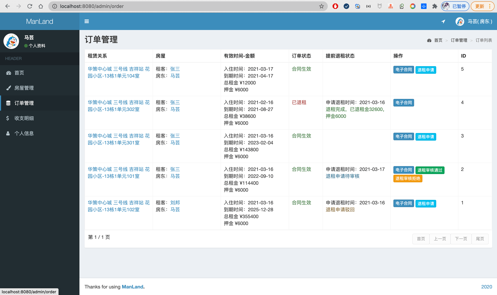
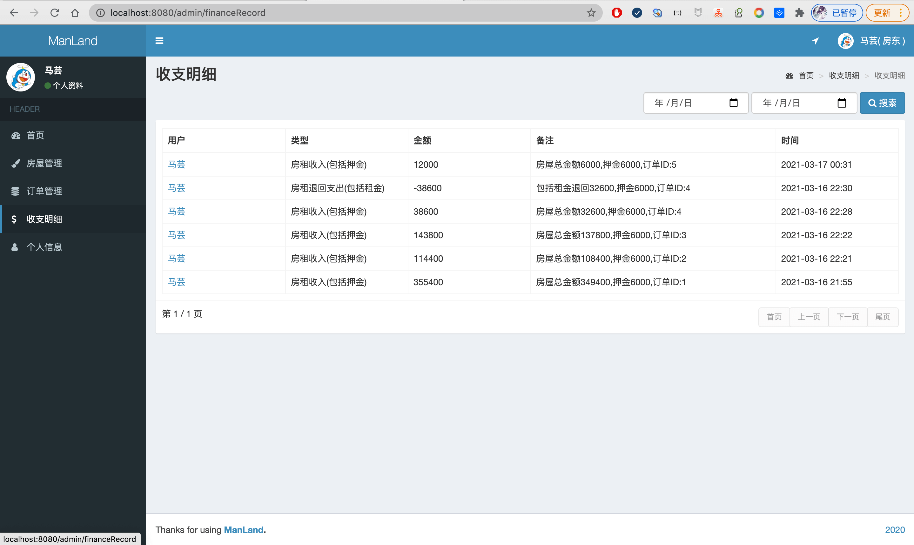
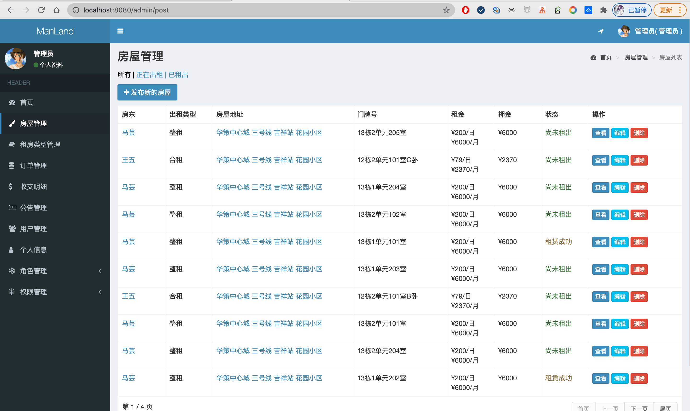
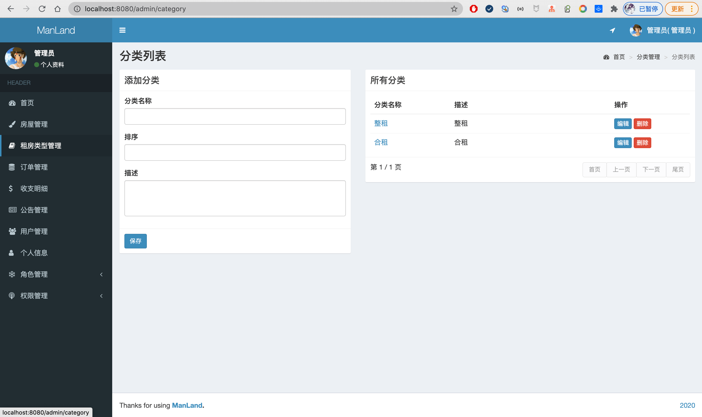
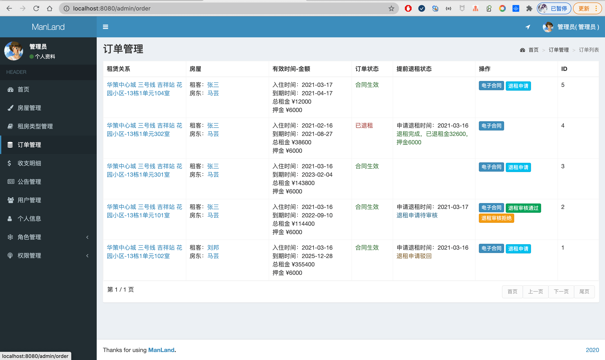
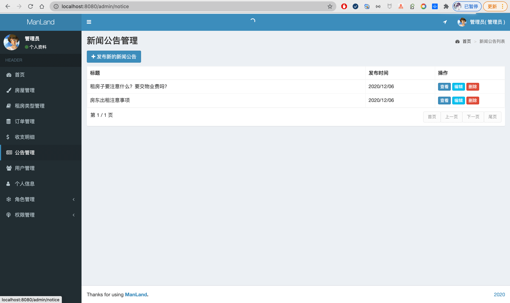
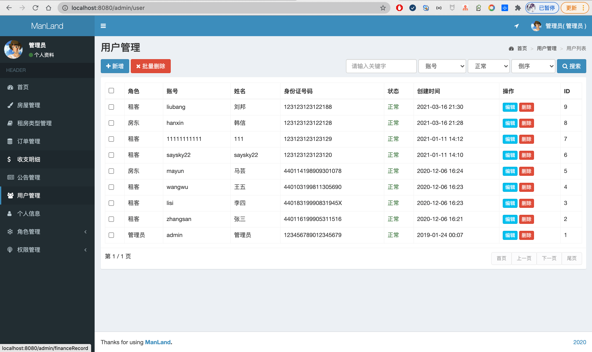

其他页面，请直接通过演示网站访问  
管理员账号admin/123456，房东mayun/123456，租客zhangsan/123456

## 联系方式
目前只开源后端代码，需要前端和sql等完整代码请联系博主  
同时也提供部署或讲解服务   
微信/QQ：847064370  
[博主博客主页](https://liuyanzhao.com)  

## 日志
- 2021/3/17
    - 大改
    - 角色改成 管理员、房东和租客三种，将原来用户角色拆分成房东和租客
    - 租房时间单位由月改成日，租房时可以选择租到具体哪一天
    - 新增退租功能
    - 取消充值，用户余额字段，新增收支明细
    - 管理员可以对订单做任何操作操作

- 2020/12/14
    - 根据部分同学要求，重构代码
    — 修改导航菜单，加入图标
    - 固定顶部导航
    - 添加城市切换切换卡
    - 添加合租室友信息
    
- 2020/12/06
    - 根据部分同学要求，重构代码
    - 把房东和租客两种角色合二为一，用户既可以租房也可以发布出租信息。 
    - 把租房分类改成了整租和合租。
    - 新增余额充值和收支明细，以及付款后租客余额减少，出租人越增加，定时返回押金
    - 修改了合同内容，新增合同下载和打印
    - 新增新闻公告
    - 新增联系我们页面
    - 新增押金字段
    - 新增支持租金和面积检索

- 2020/10/18
- 完成初步开发
- 管理员功能：登录，房屋管理、房屋类型管理、订单管理、房东管理，租客管理、财务统计，个人信息等。还要角色管理和权限管理，这里隐藏了。
- 房东功能：注册，登录，房屋管理(房屋添加修改删除上架等)、订单管理、查看电子合同。
- 租客功能：注册，登录，房屋检索，房屋租赁，查看订单，查看电子合同。
