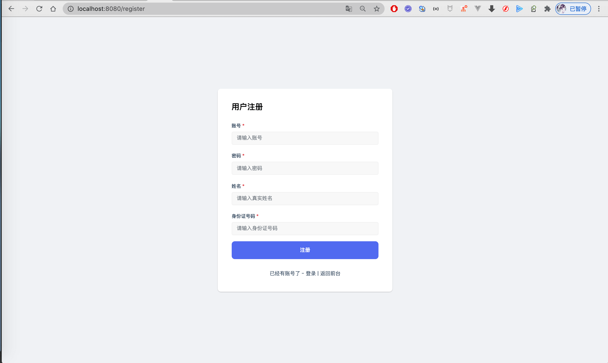
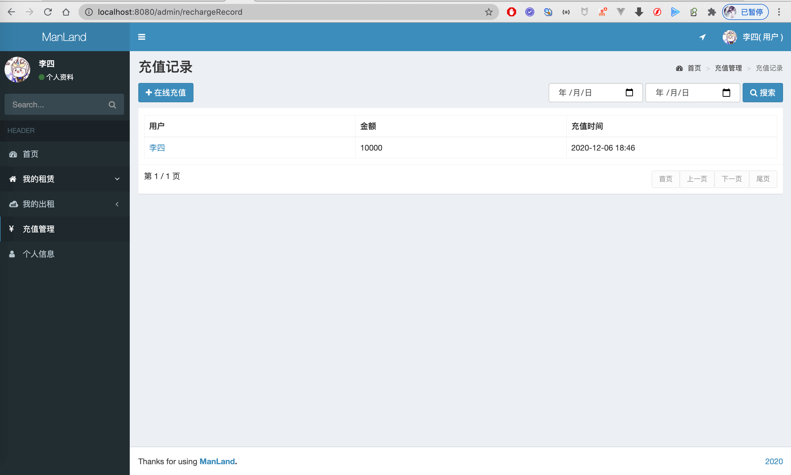
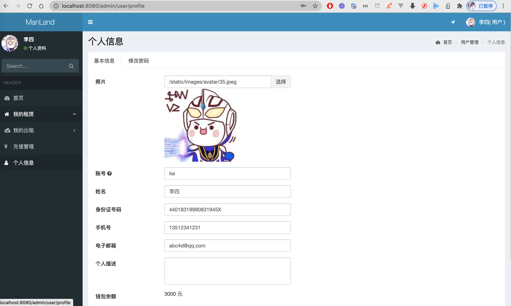
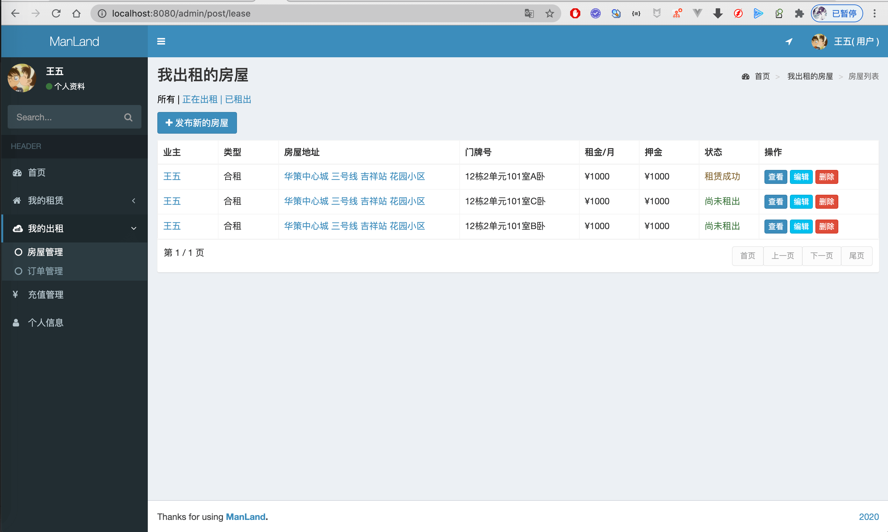
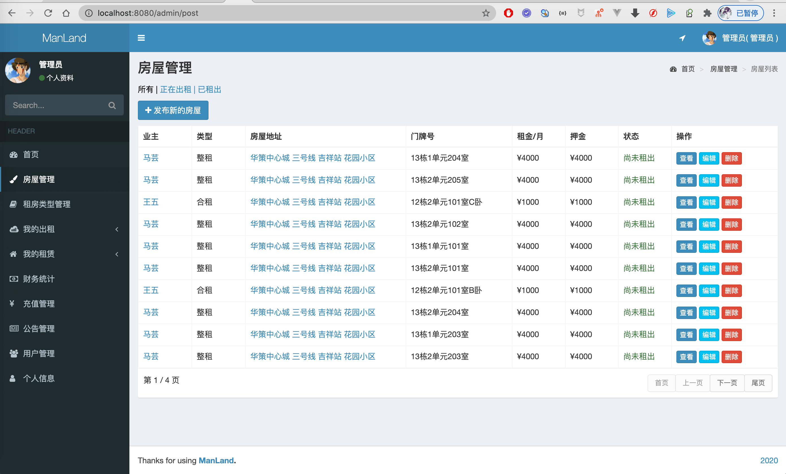
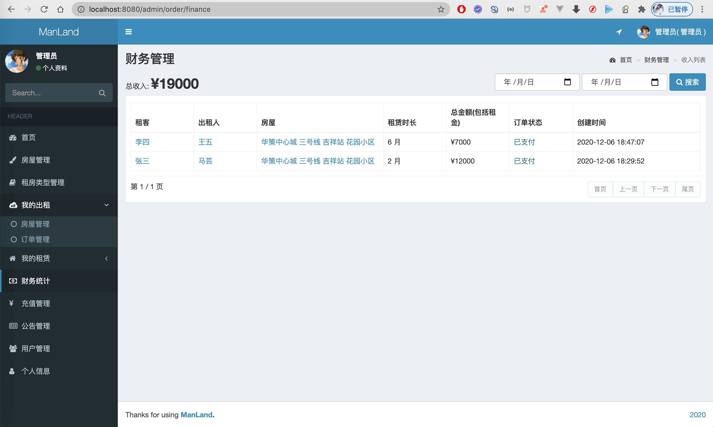
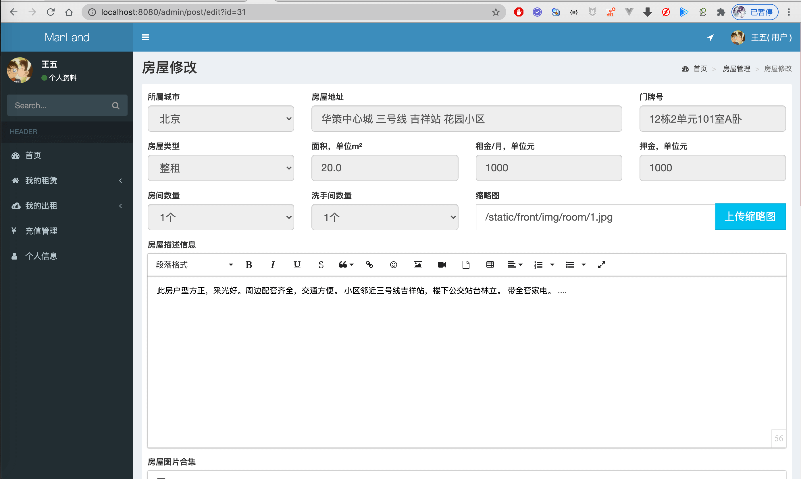

# 租房系统
基于SpringBoot实现的租房系统，包括三种角色：管理员、业主、租客。
#### 管理员功能：
- 拥有用户的所有功能，额外功能如下
- 新闻公告管理(增删改查)
- 财务统计(所有订单查看)
- 租房类型管理(合租/整租)
- 房屋管理
- 用户管理
- 角色管理、权限管理(这里在菜单隐藏了)

#### 用户功能(最新版本业主和租客二合一)：
- 我的租赁
- &nbsp;&nbsp;&nbsp;&nbsp; 房屋管理(查看)
- &nbsp;&nbsp;&nbsp;&nbsp; 订单管理(订单查询，支付，取消支付，删除，电子合同查看、下载、打印)
- 我的出租
- &nbsp;&nbsp;&nbsp; 房屋管理(增删改查)
- &nbsp;&nbsp;&nbsp; 订单管理(查看，删除，电子合同查看、下载、打印)
- 充值管理(充值记录，充值余额)
- 个人信息(个人资料，修改密码)

详细介绍：[https://liuyanzhao.com/shop/1317668426088583168.html](https://liuyanzhao.com/shop/1317668426088583168.html)  
预览地址：[https://manland.liuyanzhao.com](https://manland.liuyanzhao.com)

开发时间 2020年10月17日  
## 技术组成
- SpringBoot
- MyBatis
- Shiro
- Thymeleaf
- Bootstrap + jQuery
- MySQL
- Maven

## 预览

Process finished with exit code 0

## 联系方式
目前只开源后端代码，需要前端和sql等完整代码请联系博主  
同时也提供部署或讲解服务   
微信/QQ：847064370  
[博主博客主页](https://liuyanzhao.com)  

## 日志
- 2020/12/06
- 根据部分同学要求，重构代码
- 把业主和租客两种角色合二为一，用户既可以租房也可以发布出租信息。 
- 把租房分类改成了整租和合租。
- 新增余额充值和充值记录，以及付款后租客余额减少，出租人越增加，定时返回押金
- 修改了合同内容，新增合同下载和打印
- 新增新闻公告
- 新增联系我们页面
- 新增押金字段
- 新增支持租金和面积检索

- 2020/10/18
- 完成初步开发
- 管理员功能：登录，房屋管理、房屋类型管理、订单管理、业主管理，租客管理、财务统计，个人信息等。还要角色管理和权限管理，这里隐藏了。
- 业主功能：注册，登录，房屋管理(房屋添加修改删除上架等)、订单管理、查看电子合同。
- 租客功能：注册，登录，房屋检索，房屋租赁，查看订单，查看电子合同。
