# 租房系统
基于SpringBoot实现的租房系统，包括三种角色：管理员、业主、租客。
- 管理员功能：登录，房屋管理、房屋类型管理、订单管理、业主管理，租客管理、财务统计，个人信息等。还要角色管理和权限管理，这里隐藏了。
- 业主功能：注册，登录，房屋管理(房屋添加修改删除上架等)、订单管理、查看电子合同。
- 租客功能：注册，登录，房屋检索，房屋租赁，查看订单，查看电子合同。

详细介绍：[https://liuyanzhao.com/shop/1317668426088583168.html](https://liuyanzhao.com/shop/1317668426088583168.html)

开发时间 2020年10月17日  
## 技术组成
- SpringBoot
- MyBatis
- Shiro
- Thymeleaf
- Bootstrap + jQuery
- MySQL
- Maven

## 预览

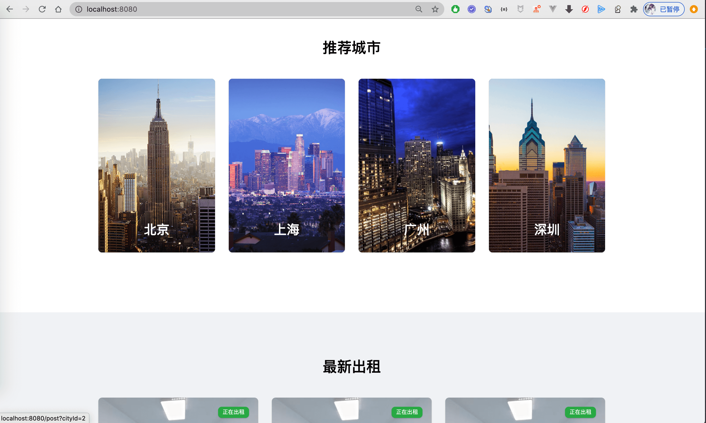
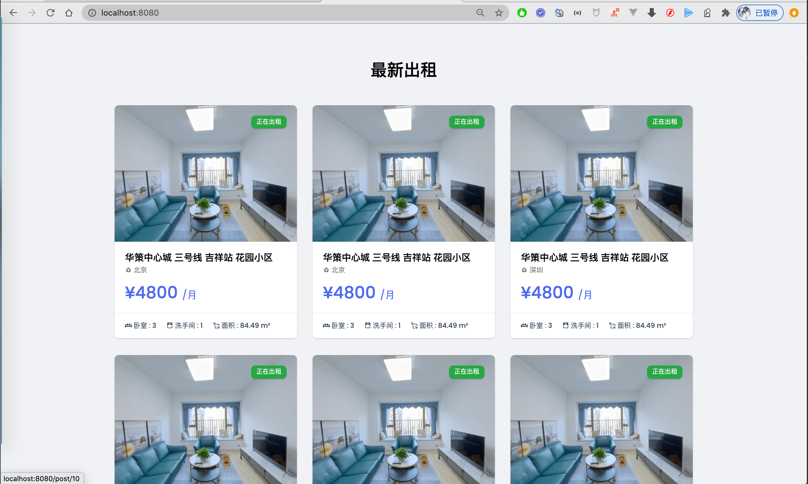
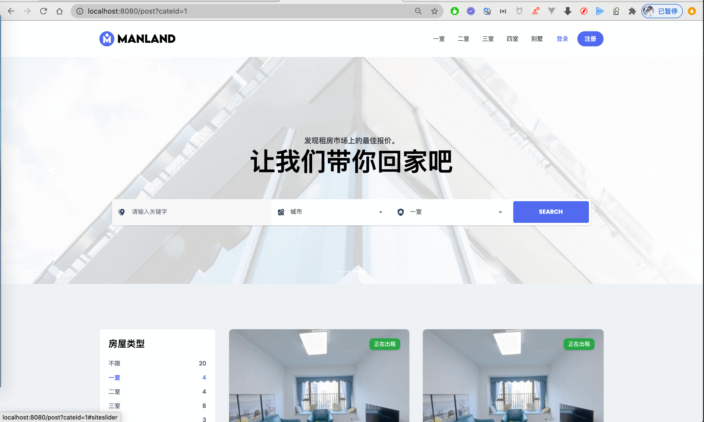
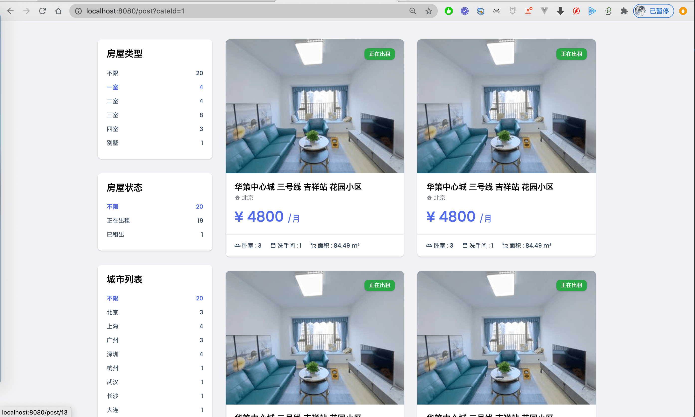

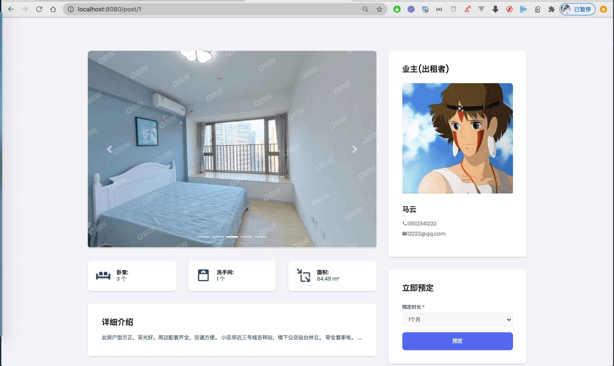
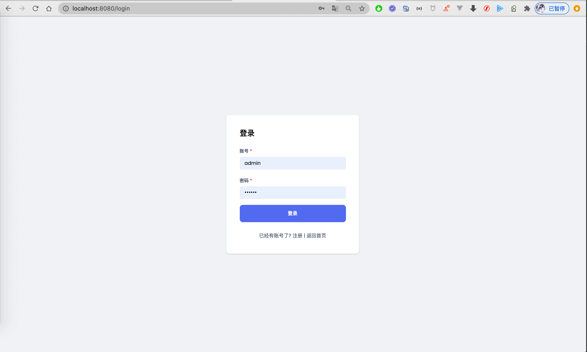
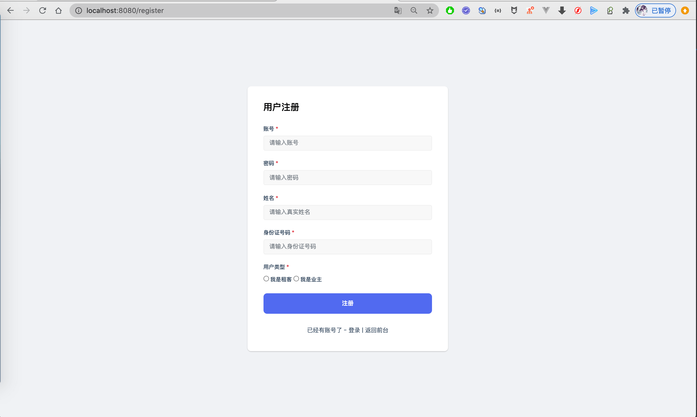
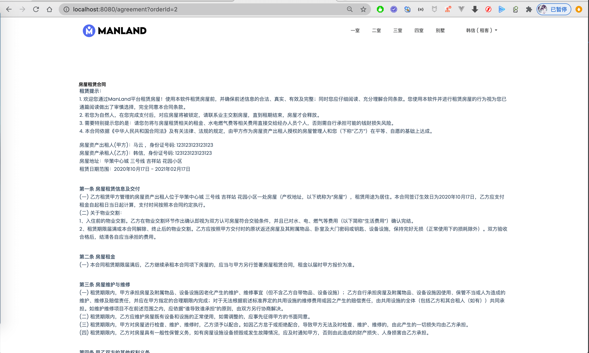

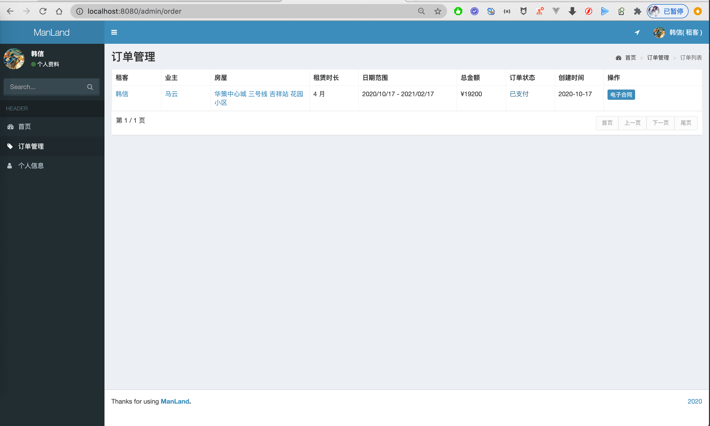
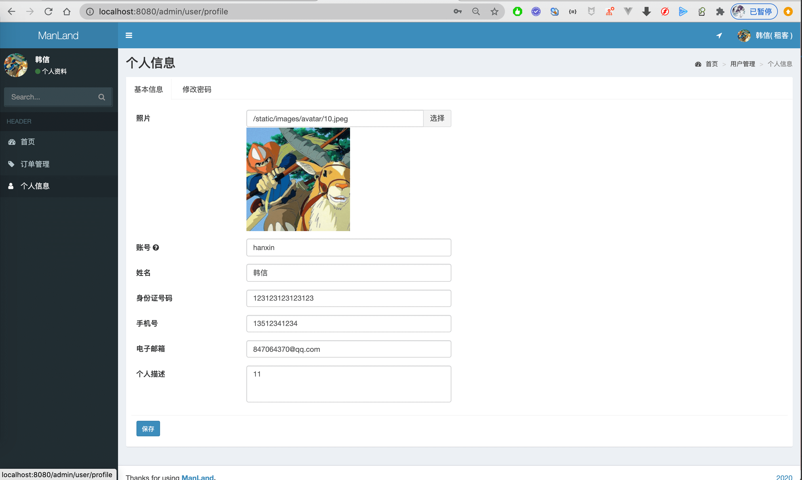
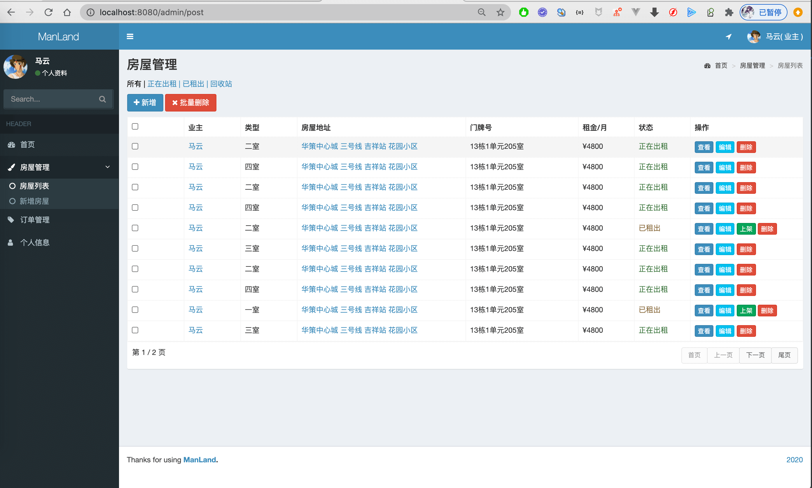
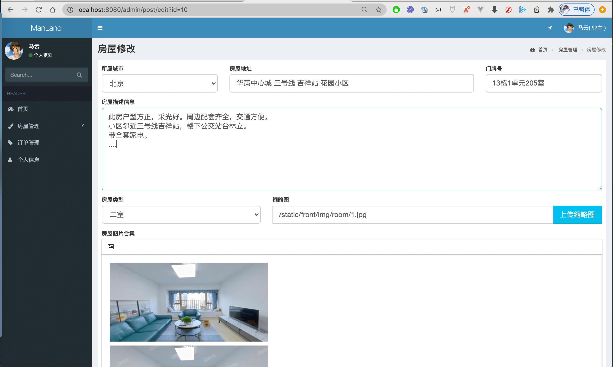
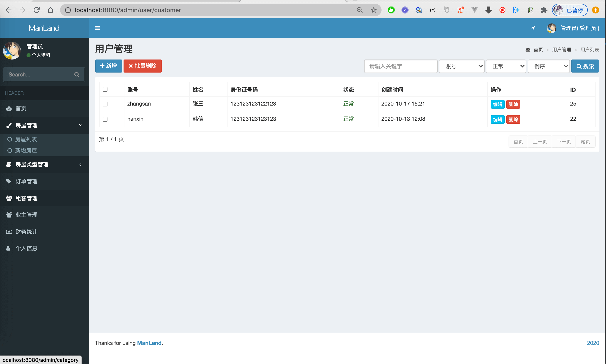
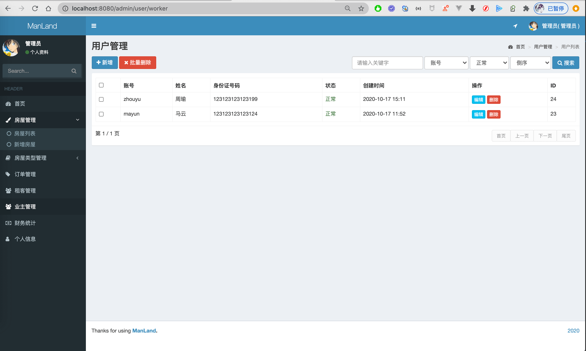
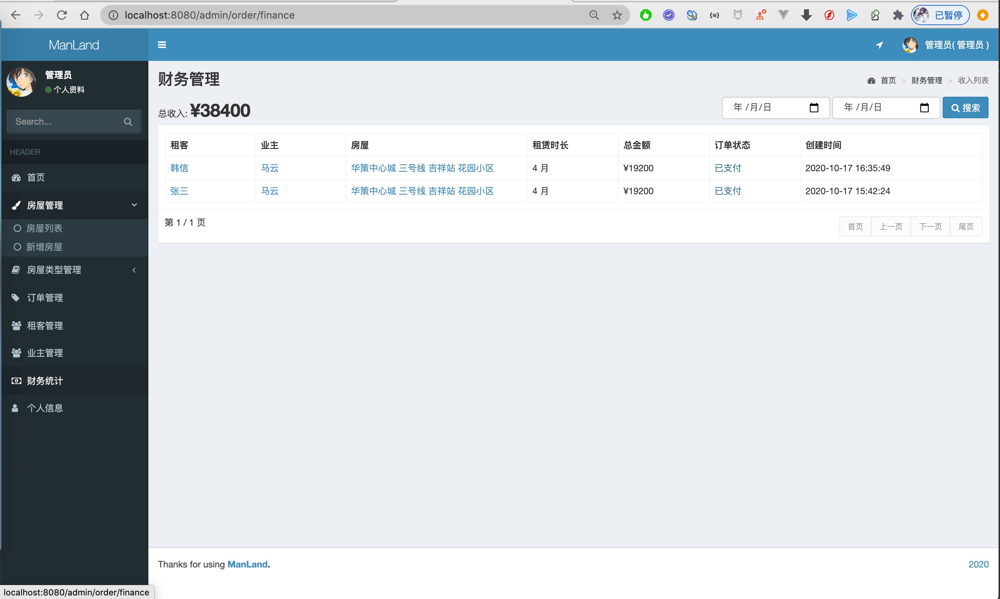

## 联系方式
目前只开源后端代码，需要前端和sql等完整代码请联系博主  
同时也提供部署或讲解服务   
微信/QQ：847064370  
[博主博客主页](https://liuyanzhao.com)  
